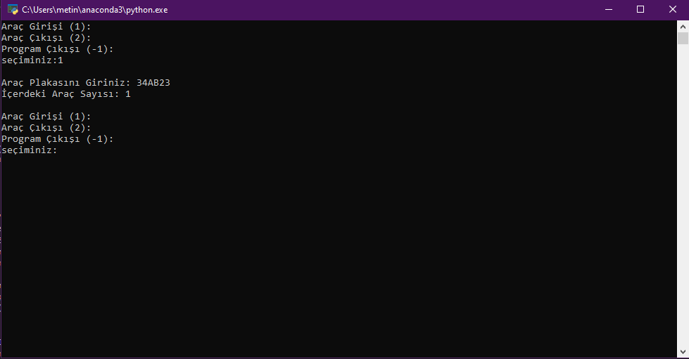

# otopark-uygulamasi
(Phyton)

## Python ile otopark kayıt sistemi

### Kullanıcı seçenekleri arasında kayıt, silme, ve çıkış işlemlerinden herhangi birini seçtikten sonra seçilen aracın plakasını giriniz. ardından içerdeki araç sayısını size döndürür ve ana menüye tekrar döner.

